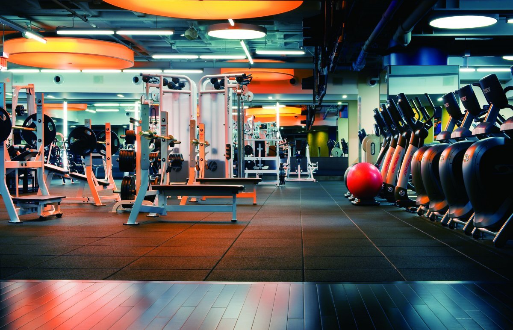

# Планы на месяц

## просыпаться по будильнику

## бегать
Чтобы выделить текст курсивом необходимо обрамить его звездочками (*). Например, *вот так*.

## приготовить себе завтрак и помыть посуду
Чтобы выделить текст полужирным, необходимо обрамить его двойными звездочками (**). Например **вот так**

## поработать и встретиться с друзьями

## сходить в зал

Чтобы вставить изображение в текст достаточно написать следующее:

## приготовь себе ужин
Чтобы выделить ненумерованный список, используйте (*)
## помыть всю посуду

## лечь спать

## не просыпаться до самого утра

## поплавать за городом

## успеть сделать дз

## создать ветку

* написать текст

## создать вторую ветку

* написать второй текст

## создать третью ветку

* написать третий текст

* написать четвертый текст

* написать